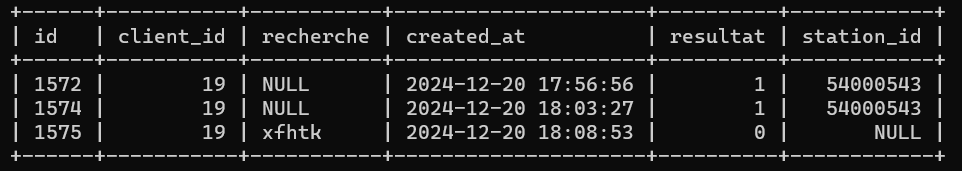
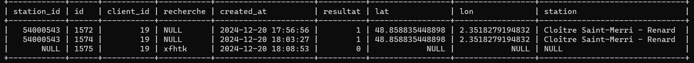
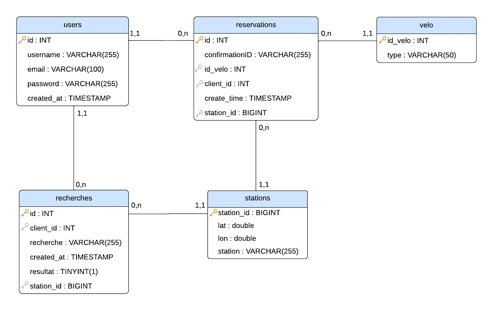
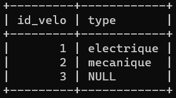

# Projet : Application Web de Service Vélib'

## Livrable 2 : Conception de la base de données

### Sommaire

1. [Description du livrable](#1-description)
2. [Objectifs de la base de donnée](#2-objectifs-de-la-base-de-donnée)
   - [Prérequis](#prérequis)
   - [Installation](#installation)
3. [Structure de la base de données](#3-structure-de-la-base-de-données)
   - [Tables principales](#31-tables-principales)
   - [Vues](#32-vues)
   - [Relations entre les tables](#33-relations-entre-les-tables)
4. [Création d'un utilisateur pour notre base de données](#4-création-dun-utilisateur-pour-notre-base-de-données)
5. [Insertion des données dans nos tables](#5-insertion-des-données-dans-nos-tables)
   - [Alimentation de la table velo](#51-alimentation-de-la-table-velo)
   - [Alimentation de la table stations](#52-alimentation-de-la-table-stations)
     - [Explication du Script Python pour l'Insertion et la Mise à Jour des Stations](#explication-du-script-python-pour-linsertion-et-la-mise-à-jour-des-stations)
6. [Déploiement de la Base de Données](#6-déploiement-de-la-base-de-données)

# 1. Description

Dans le cadre de ce livrable, nous devions élaborer une base de données utile, pour notre site Vélib’, qui a un rôle majeur pour le projet, car elle permet de centraliser et d’organiser toutes les données liées à ceux-ci, les utilisateurs, mais également les données et informations qui leur sont relatives, à savoir leurs comptes, leurs historiques de recherche, ainsi que les réservations effectuées.

Pour résumer, c’est cette base de données qui est au centre du projet Vélib’, qui permet d’assurer le fonctionnement du site, mais aussi de donner la possibilité à l’usager d’avoir une expérience optimale, simple, rapide et adaptée.

<br>

# 2. Objectifs de la base de donnée

L'objectif principal de cette base de données est de soutenir le fonctionnement du site Vélib'. Elle doit permettre de :

### Gérer les comptes utilisateurs :

- Création de comptes.
- Connexion des utilisateurs.
- Mise à jour des informations personnelles.

### Stocker l'historique des recherches et des réservations :

- Enregistrer toutes les recherches effectuées (**adresse ou nom de station**) par les utilisateurs.
- Permettre à l'utilisateur de consulter l'historique de ses recherches et de ses réservations.
- Offrir à l'utilisateur la possibilité de supprimer l'historique de ses recherches s'il le souhaite.
- Conserver l'historique des réservations, mais sans permettre à l'utilisateur de le modifier ou de le supprimer.

### Optimisation des données :

- Structurer efficacement les informations pour accélérer les requêtes et améliorer les performances globales.
- Garantir la cohérence et l'intégrité des données.

  <br>

## Prérequis

- **Python 3.8+** doit être installé.
- Bibliothèques Python nécessaires :
  - `mysql-connector-python` pour connection a notre base de donees.
  - `requests` pour les requêtes HTTP.
- **MySQl** doit être installé.

## Installation

1. **Installation des bibliothèques Python** la commande :
   ```bash
   pip install requests mysql-connector-python
   ```
2. **Installation de mysql-server** la commande :

   ```bash
   sudo apt install mysql-server
   ```

   - Après l'installation, si MySQL ne démarre pas automatiquement, vous pouvez le démarrer manuellement en exécutant la commande suivante :

     ```bash
     sudo systemctl start mysql
     ```

3. **Configuration de mysql** :

   Pour accéder à MySQL, si on ne vous a pas demandé de définir un mot de passe pour l'utilisateur root, commencez par taper la commande suivante pour en définir un :

   ```bash
   sudo mysql -u root
   ```

   Après avoir accédé à MySQL, pour définir un mot de passe, tapez la commande suivante :

   ```bash
   ALTER USER 'root'@'localhost' IDENTIFIED WITH mysql_native_password BY 'new_password';
   ```

   Maintenant, le mot de passe est bien défini. Pour accéder à la base de données en tant que root, tapez la commande suivante :

   ```bash
   sudo mysql -u root -p
   ```

   Il vous sera alors demandé de saisir le mot de passe que vous venez de définir.

<br>

# 3. Structure de la base de données

La base de données est composée de 5 tables interconnectées et 2 vues pour gérer les informations nécessaires au fonctionnement du site Vélib'.

Voici une description détaillée des tables et de leurs relations :

## 3.1 Tables principales

### 1. Table `users`

- Cette table gère les informations des utilisateurs.
- **Colonnes principales** :
  - `id` : Identifiant unique de l'utilisateur.
  - `username` : Nom d'utilisateur.
  - `email` : Adresse email de l'utilisateur.
  - `password` : Mot de passe de l'utilisateur (stocké sous forme hachée pour plus de sécurité).
  - `created_at` : Date et heure de création du compte.

### 2. Table `velo`

- Cette table contient les informations sur les Types des vélos.
- **Colonnes principales** :
  - `id_velo` : Identifiant unique du type.
  - `type` : Type de vélo (électrique, classique).

### 3. Table `stations`

- Cette table regroupe les informations de tous les stations de vélos dispobile chez velib.
- **Colonnes principales** :
  - `station_id` : Identifiant unique de la station.
  - `lat` : Latitude de la station.
  - `lon` : Longitude de la station.
  - `station` : Nom de la station.

### 4. Table `reservations`

- Cette table stock les réservations effectuées par les utilisateurs.
- **Colonnes principales** :
  - `id` : Identifiant unique de la réservation.
  - `confirmationID` : Code de confirmation unique pour la réservation.
  - `id_velo` : Référence au vélo réservé (liée à `velo.id_velo`).
  - `client_id` : Référence à l'utilisateur ayant effectué la réservation (liée à `users.id`).
  - `create_time` : Date et heure de la réservation.
  - `station_id` : Référence à la station de réservation (liée à `stations.station_id`).
- **Relations** : Cette table contient des clés étrangères pour garantir l'intégrité des données :
  - `id_velo` → `velo.id_velo`.
  - `client_id` → `users.id`.
  - `station_id` → `stations.station_id`.

### 5. Table `recherches`

- Cette table stocke les recherches effectuées par les utilisateurs.
- **Colonnes principales** :
  - `id` : Identifiant unique de la recherche.
  - `client_id` : Référence à l'utilisateur ayant effectué la recherche (liée à `users.id`).
  - `recherche` : Terme recherché (elle est `NULL` si le terme rcherché est une station existante dans le tabalux `stations`).
  - `created_at` : Date et heure de la recherche.
  - `resultat` : Résultat de la recherche (succès ou échec).
  - `station_id` : Référence à une station liée à la recherche (liée à `stations.station_id`) (elle est `NULL` si le terme rcherché est une station NON existante dans le tabalux `stations`).
- **Relations** : Clés étrangères pour relier cette table à :
  - `client_id` → `users.id`.
  - `station_id` → `stations.station_id`.

**_Voici un exmple concret:_**



## 3.2 Vues

Les vues d’une base de données rendent plus simple l’accès aux données en cachant la complexité des tables sous-jacentes et en rendant moins complexe la gestion des requêtes complexes, en regroupant jointures et filtres.

### 1. Vue `recherches_vue`

- Affiche l'historique des recherches des utilisateurs, avec des informations supplémentaires sur les stations associées.
- Cette vue combine les données des tables `recherches` et `stations` pour fournir une vision complète des recherches.
- Elle utilise le `LEFT JOIN` entre `recherches` et `stations` par la clé `station_id`, afin que si le terme recherché n'est pas une station valide, la `station_id` soit NULL. Avec le ` LEFT JOIN` , les données de la table `stations` seront également NULL.

**_Voici un exmple concret:_**



Dans la troisième ligne, on peut voir que l'utilisateur a effectué une recherche pour `xfhtk`. Notre site web a détecté que ce nom de station n'existe pas, et l'a donc stocké dans la colonne recherche, avec `station_id` mis à NULL. Contrairement à la première ligne, où l'utilisateur a recherché une station existante, et où le `station_id` contenant l'ID de la station a été stocké.( [Voir l'example dans le tableau](Capture/recherches.png) )

Ainsi, avec un `LEFT JOIN`, toutes les lignes de la table recherches sont affichées, même celles où l'attribut `station_id` est NULL. Si aucune correspondance n'est trouvée dans la table `stations`, les colonnes de la table `stations` seront remplies avec des valeurs NULL. Cela permet de visualiser toutes les recherches, même celles où aucune station correspondante n'existe.

En revanche, si l'on utilise un `JOIN`, les lignes où `station_id` est NULL ne seront pas affichées, car le `JOIN` exclut les lignes qui n'ont pas de correspondance dans la table `stations`. Ainsi, seules les recherches pour des stations valides (avec un `station_id` existant) seront affichées.

### 2. Vue `reservation_vue`

- Fournit un récapitulatif des réservations, incluant les détails des vélos et des stations associés.
- Cette vue fusionne les données des tables `reservations`, `stations` et `velo`.

## 3.3 Relations entre les tables

La base de données est construite sur un modèle relationnel solide :

- La table `reservations` est reliée à :
  - `users` via `client_id`.
  - `velo` via `id_velo`.
  - `stations` via `station_id`.
- La table `recherches` est reliée à :

  - `users` via `client_id`.
  - `stations` via `station_id`.

**_Voici un diagramme UML qui montre les relations entre les tables ainsi que les types de chaque attribut_**



<br>

**_Le fichier contenant la création des tables et des vues est intitulé : `Velib_SAE_Tableau.sql`_**

<br>

# 4. Création d'un utilisateur pour notre base de données

Pour renforcer la sécurité de notre base de données, nous avons créé un utilisateur nommé `user_velib`:

```sql
-- Créer un utilisateur nommé 'user_velib' avec un mot de passe 'saevelib'
CREATE USER 'user_velib'@'localhost' IDENTIFIED BY 'saevelib';
```

Après la création de notre nouvel utilisateur, nous lui accorderons des privilèges sur chaque table selon [les besoins](#2-objectifs-de-la-base-de-donnée).

## Privilèges sur chaque table

1. **Privilèges sur la table `stations` :**

   ```sql
   -- privilèges sur la table stations (uniquement SELECT)
   GRANT SELECT ON sae_velib.stations TO 'user_velib'@'localhost';
   ```

   L'utilisateur `user_velib` a uniquement un privilège de lecture (SELECT) sur la table `stations`, ce qui signifie qu'il peut uniquement consulter les données sans pouvoir les modifier.

2. **Privilèges sur la table `velo` :**

   ```sql
   -- privilèges sur la table velo (uniquement SELECT)
   GRANT SELECT ON sae_velib.velo TO 'user_velib'@'localhost';
   ```

   L'utilisateur a également un privilège de lecture (SELECT) sur la table `velo`, ce qui lui permet de consulter les informations relatives aux types de velo sans pouvoir effectuer de modifications.

3. **Privilèges sur la table `reservations` :**

   ```sql
   -- privilèges sur la table reservations (SELECT, INSERT)
   GRANT SELECT, INSERT ON sae_velib.reservations TO 'user_velib'@'localhost';
   ```

   L'utilisateur dispose des privilèges **SELECT** (pour lire les données) et **INSERT** (pour ajouter de nouvelles réservations) sur la table `reservations`.

4. **Privilèges sur la table `recherches` :**

   ```sql
   -- privilèges sur la table recherches (SELECT, DELETE, INSERT)
   GRANT SELECT, DELETE, INSERT ON sae_velib.recherches TO 'user_velib'@'localhost';
   ```

   L'utilisateur a des privilèges **SELECT**, **DELETE** et **INSERT** sur la table `recherches`, ce qui lui permet de lire, supprimer et ajouter des enregistrements de recherches.

5. **Privilèges sur la table `users` :**

   ```sql
   -- privilèges sur la table users (SELECT, UPDATE, INSERT)
   GRANT SELECT, UPDATE, INSERT ON sae_velib.users TO 'user_velib'@'localhost';
   ```

   L'utilisateur bénéficie des privilèges **SELECT**, **UPDATE** et **INSERT** sur la table `users`, lui permettant de lire, modifier et ajouter des informations sur ses propres donees.

6. **Privilèges sur les vues `recherches_vue` et `reservations_vue` :**

   ```sql
    GRANT SELECT ON sae_velib.recherches_vue TO 'user_velib'@'localhost';

    GRANT SELECT ON sae_velib.reservations_vue TO 'user_velib'@'localhost';
   ```

   L'utilisateur `user_velib` a uniquement un privilège de lecture (SELECT) sur les vues , ce qui signifie qu'il peut uniquement consulter les données
   <br>

Cette configuration va nous permettre de sécuriser l’accès à la base de données en restreignant les privilèges d’accès en fonction du besoin prescrit de l’utilisateur, cela afin de garantir qu’il puisse avoir accès aux données nécessaires tout en évitant qu’il ne puisse effectuer certaines actions qui pourraient permettre des modifications non autorisées. Également, nous allons ajouter dans le backend du site des mesures de sécurité pour s’assurer que les requêtes ne soient pas contournées par des injections de requêtes malveillantes, assurant ainsi l’intégrité et la sécurité des données et interactions avec la base de données.

<br>

**_Le fichier contenant la création de l'utilisateur : `Velib_SAE_USER.sql`_**

# 5. Insertion des données dans nos tables

Une fois la base de données créée, il reste une étape essentielle :

remplir les tables avec les données nécessaires pour assurer le bon fonctionnement du système. Les tables à remplir sont `stations` et `velo`, car elles sont directement liées aux tables `recherche` et `réservation`.

- `recherche` → `stations`.
- `réservation` → `stations` ; `réservation` → `velo`

En effet, si ces tables ne sont pas alimentées, la base de données ne pourra pas fonctionner correctement, car il manquera des références nécessaires pour les processus de recherche et de réservation. Il est donc crucial de remplir ces tables pour garantir la cohérence et l'intégrité des opérations au sein de la base de données.

## 5.1 Alimentation de la table `velo`

Pour notre table `velo`, nous remplissons 3 lignes pour définir 3 types de vélos : mécanique, électrique ou NULL. Les requêtes utilisées sont :

```sql
INSERT INTO velo (id_velo, type) VALUES (1, 'electrique');
INSERT INTO velo (id_velo, type) VALUES (2, 'mecanique');
INSERT INTO velo (id_velo, type) VALUES (3, NULL);
```

**_Le resultat attendu :_**



## 5.2 Alimentation de la table `stations`

Pour la table `stations`, le processus est un peu différent. Les données des stations, telles que le `nom`, la `latitude` et la `longitude`, sont fournies par l'API Vélib. Ainsi, nous devons récupérer ces informations via l'API et les insérer dans la table. De plus, il est nécessaire de vérifier à chaque mise à jour si les informations de chaque station ont été modifiées ou si Vélib a ajouté de nouvelles stations.

Pour automatiser ce processus, nous avons décidé de créer un script `Python`. Ce script récupérera les données des stations depuis l'API Vélib et vérifiera si chaque station existe déjà dans la table `stations`. Si une station n'est pas présente, elle sera insérée. Si la station existe déjà, nous comparerons les données actuelles avec les nouvelles. Si des différences sont détectées, nous mettrons à jour les informations avec les nouvelles données.

## Explication du Script Python pour l'Insertion et la Mise à Jour des Stations

Ce script Python a pour but de récupérer les données des stations à partir d'une API et de les insérer ou mettre à jour dans une base de données MySQL. Voici une explication détaillée de chaque section du code.

### 1. Importation des Modules Nécessaires

```python
import requests
import mysql.connector
```

- **`requests`** : Permet d'envoyer des requêtes HTTP pour récupérer les données de l'API.
- **`mysql.connector`** : Utilisé pour se connecter à la base de données MySQL et exécuter des requêtes.

### 2. Connexion à la Base de Données

```python
conn = mysql.connector.connect(
    host="localhost",  # Remplace par ton hôte
    user="root",  # Remplace par ton utilisateur de base de données
    password="yannel",  # Remplace par ton mot de passe
    database="user"  # Remplace par le nom de ta base de données
)
cursor = conn.cursor(dictionary=True)
```

- **`conn`** : Établit une connexion avec la base de données MySQL.
- **`cursor`** : Crée un curseur pour exécuter des requêtes SQL. Le paramètre `dictionary=True` permet de récupérer les résultats sous forme de dictionnaire (avec des noms de colonnes comme clés).

### 3. Définir l'URL de l'API

```python
url_api = "http://localhost:5000/stations"
```

- L'URL de l'API contient le chemin qui nous permet d'accéder aux données des stations. Il s'agit notre API Flask que on a creer dans le premier livrable.

### 4. Récupérer les Données de l'API

```python
response = requests.get(url_api)
stations = response.json()
```

- **`requests.get(url_api)`** : Envoie une requête HTTP GET à l'API pour récupérer les données des stations.
- **`response.json()`** : Convertit la réponse JSON en un objet Python (ici, une liste de stations).

### 5. Initialisation des Compteurs

```python
nbInsertion = 0
nbUpdate = 0
```

- **`nbInsertion`** et **`nbUpdate`** : Compteurs utilisés pour suivre respectivement le nombre d'inserts et de mises à jour effectuées dans la base de données.

### 6. Parcours des Stations et Gestion de l'Insertion ou de la Mise à Jour

```python
for station in stations:
    station_id = station['station_id']
    lat = station['lat']
    lon = station['lon']
    name = station['name']
```

- Cette boucle **`for`** parcourt chaque station dans la liste `stations`. Pour chaque station, elle extrait l'ID, la latitude, la longitude et le nom.

### 7. Vérifier si la Station Existe Déjà dans la Base de Données

```python
cursor.execute("SELECT COUNT(*) FROM stations WHERE station_id = %s", (station_id,))
result = cursor.fetchone()
```

- **`SELECT COUNT(*)`** : Vérifie si la station avec l'ID donné existe déjà dans la table `stations`. Si le nombre de stations trouvées est 0, cela signifie qu'elle n'existe pas encore dans la base de données.

### 8. Si la Station N'existe Pas, Insérer les Données

```python
if result['COUNT(*)'] == 0:
    try:
        cursor.execute(
            "INSERT INTO stations (station_id, lat, lon, station) VALUES (%s, %s, %s, %s)",
            (station_id, lat, lon, name)
        )
        nbInsertion += 1
    except mysql.connector.IntegrityError as e:
        print(f"Erreur d'insertion pour la station ID {station_id}: {e}")
```

- Si la station n'existe pas, une requête **`INSERT INTO`** est exécutée pour ajouter les données dans la table `stations`.
- En cas d'erreur (par exemple, si des contraintes d'intégrité sont violées), l'exception est capturée et un message d'erreur est affiché.

### 9. Si la Station Existe, Comparer les Données et Mettre à Jour si Nécessaire

```python
else:
    cursor.execute("SELECT lat, lon, station FROM stations WHERE station_id = %s", (station_id,))
    donner = cursor.fetchone()

    current_lat = donner['lat']
    current_lon = donner['lon']
    current_name = donner['station']
    if current_lat != lat or current_lon != lon or current_name != name:
        try:
            cursor.execute(
                "UPDATE stations SET lat = %s, lon = %s, station = %s WHERE station_id = %s",
                (lat, lon, name, station_id)
            )
            print("current info :", current_lat, "/// new info : ", lat)
            nbUpdate += 1
        except mysql.connector.Error as e:
            print(f"Erreur de mise à jour pour la station ID {station_id}: {e}")
```

- Si la station existe déjà, le script compare les valeurs actuelles dans la base de données avec les nouvelles données de l'API.
- Si des différences sont trouvées (par exemple, des coordonnées ou un nom différents), il met à jour les données avec une requête **`UPDATE`**.
- Si une erreur se produit pendant la mise à jour, l'exception est capturée et un message d'erreur est affiché.

### 10. Valider les Modifications et Afficher les Résultats

```python
conn.commit()

print("Insertion des stations terminée.")
print("Nombre d'insertion: ", nbInsertion)
print("Nombre de changement: ", nbUpdate)
```

- **`conn.commit()`** : Applique toutes les modifications (insertions et mises à jour) dans la base de données.
- Affiche ensuite le nombre d'insertion et de mises à jour effectuées.

### 11. Fermer la Connexion à la Base de Données

```python
cursor.close()
conn.close()
```

- Ferme le curseur et la connexion à la base de données pour libérer les ressources.

**Il est important d'exécuter ce script à intervalles réguliers, par exemple toutes les 1 à 2 heures, afin de vérifier les nouvelles stations à insérer ou les stations existantes à mettre à jour. Cela permet de garantir que les données des stations restent toujours à jour.On peut automatiser l'exécution de ce script en utilisant un planificateur de tâches, comme cron sur un système Linux**
<br>

**_Le fichier contenant le scripte d'insertion : `Insertion.py`_**

# 6. Déploiement de la Base de Données

Dans cette partie, nous allons vous montrer comment configurer notre base de données.

Après avoir effectué [l'installation des prérequis et la connexion à MySQL](#prérequis), voici les étapes à suivre :

### 1. Créer la base de données

La première étape consiste à créer notre base de données nommée `sae_velib` avec toutes les tables nécessaires. Pour ce faire, exécutez la commande suivante dans MySQL :

```sql
source /chemin/vers/Velib_SAE_Tableau.sql
```

### 2. Créer l'utilisateur

La deuxième étape consiste à créer l'utilisateur `sae_velib` en exécutant la commande suivante :

```sql
source /chemin/vers/Velib_SAE_USER.sql
```

### 3. Insérer les valeurs dans la table "velo"

La troisième étape consiste à insérer les trois valeurs pour le type de vélo dans la table `velo`. Exécutez les trois lignes de commande [vue precedamant](#51-alimentation-de-la-table-velo).

### 4. Insérer les valeurs dans la table "stations"

Pour la dernière étape, il suffit de quitter MySQL en utilisant la commande `exit`. Ensuite, pour remplir la table `stations`, vous devez exécuter [un script Python](#explication-du-script-python-pour-linsertion-et-la-mise-à-jour-des-stations).

Avant de lancer le script, assurez-vous de mettre à jour les informations de connexion à votre base de données :

```python
# Connexion à la base de données
conn = mysql.connector.connect(
    host="localhost",  # Remplace par ton hôte
    user="root",  # Remplace par ton utilisateur de base de données
    password="yannel",  # Remplace par ton mot de passe
    database="user"  # Remplace par le nom de ta base de données
)
```

**N'oubliez pas d'activer l'API Flask avant d'exécuter le script.**

Ensuite, vous pouvez exécuter le script d'insertion en utilisant la commande suivante :

```bash
python /chemin/vers/Insertion.py
```

**_Après avoir suivi toutes ces étapes sans erreur de code, la base de données est prête à être utilisée dans notre application web._**

Afin de vérifier le bon fonctionnement de la base de données ainsi que le développement de l’application, il convient d’effectuer certaines requêtes avec l’utilisateur `user_velib`. Dans ce cas, il s’agit de procéder à une validation du bon déroulement des opérations de sélection, d’insertion ou de mise à jour, entre autres.

Il est également intéressant de tester l’insertion de nouvelles données ou la mise à jour de données existantes de manière à s’assurer que la base enregistre bien les modifications. Dans le même temps, il est utile de tenter des requêtes que l’utilisateur ne pourrait pas exécuter, de la suppression ou de la mise à jour de données dans certaines tables, par exemple. Si une requête génère une erreur, cela montre que les restrictions sont bien appliquées et que la sécurité de la base est correcte.

Si les requêtes autorisées s’exécutent sans erreur et retournent les résultats attendus, cela signifie que la base fonctionne et que l’utilisateur a bien les droits requis pour interagir avec elle.

# 7. Groupe:

Ce projet a été réalisé dans le cadre d'un travail de groupe, les membres de groupe sont:

-Tassadit OUZIA.
-Kenza HALIL.
-Yannel AISSANI.
-Oumaima EL KHADRAOUI.
-Youssouf REZZAG MAHCENE.
